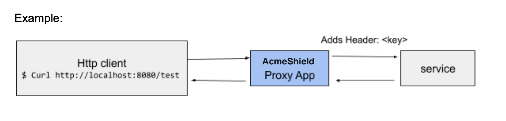

# AcmeShield


A secured HTTP proxy that forwards requests from a remote service(Postman). This is a tool that will proxy simple HTTPS requests to an external HTTP endpoint (service in the image above)

## Description

The HTTP proxy operates between the sending Web server and your receiving Web client. It processes the HTTP protocol line-by-line for any potentially harmful content before sending it to an internal Web client. It also acts as a buffer between your Web server and potentially harmful Web clients by enforcing HTTP RFC compliance and preventing potential buffer overflow.
## Getting Started

---

### Installing

* Make sure to have GoLang installed in your enviroment. Found at [https://go.dev/doc/install]
* Make sure to have Git installed on your enviroment. Found at [https://git-scm.com/downloads]

---
* When git and golang are installed.
* From a Terminal application, run the following commad to install the application:
```
go install github.com/tavikano/acmeshield@latest
```
* This command downloads acmeshield and all of its dependencies, builds the program, and installs the binary in your $GOPATH/bin directory.
### Dependencies

* *No external dependencies required.
* ** Acmeshield primarily uses Golang Standard Library. Found at [https://pkg.go.dev/std]

---
### Executing program

1. Go to the GO binaries folder. (Linux and MacOS is  ```/usr/local/go/bin``` by default, Windows is ``` C:\Go\bin``` by default).
2. Using admin priviledges, run the binary: Linux/MacOS: ```sudo ./acmeshield``` Windows: ```acmeshield.exe```.
3. Using BASH/ZSHELL termninal on a separate tab/window, run the following command:
```
curl ​http://localhost:8080/test
```
---
## Customizations

Port Configuration
```
To configure the listening port, update line 11 of the acmeshield.go file to the desired port number.
```

## Authors

Octavio Cano

## Version History

* v1.0
    * Initial Release
